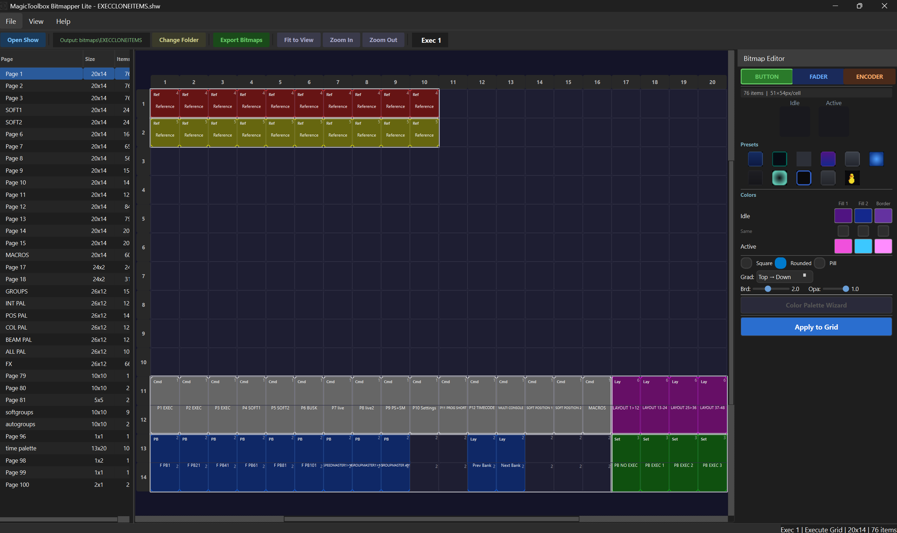
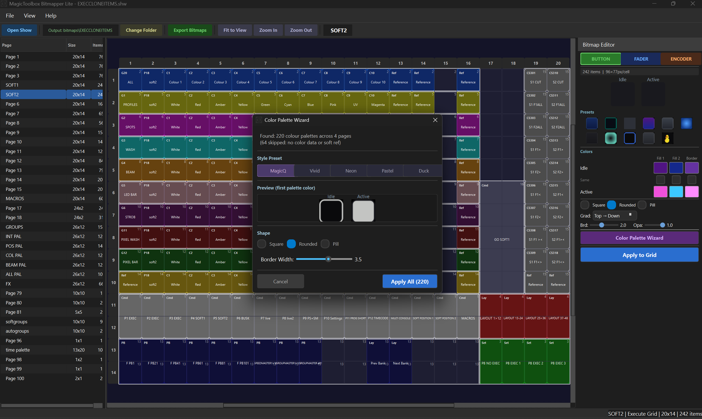

# MagicToolbox Bitmapper Lite

**Free bitmap builder for MagicQ execute grids.**

Design custom button bitmaps for your MagicQ execute pages — presets, custom colors, shapes, icons, and the famous duck mode. Export ready-to-use PNGs with a visual PDF catalog.

---

## Features

- **11 Built-in Presets** — Glass, Neon, Flat, Gradient, Metallic, Launchpad, LED Dot, Arcade, MagicQ, Console, and Duck
- **Full Customization** — Shape, corner radius, gradient direction, colors (fill, border, label), opacity, icons
- **Color Palette Wizard** — Auto-generate unique color schemes across all your execute buttons with one click
- **Apply Mode** — Click buttons on the grid to apply your bitmap design instantly
- **Visual PDF Catalog** — Every export includes a `bitmap_catalog.pdf` showing each bitmap with its filename, so you know exactly which file to assign in MagicQ
- **Smart Output Folder** — Auto-creates a bitmap folder inside your show's `bitmaps/` directory
- **Read-Only** — Never modifies your .shw show file. Loads and reads only.
- **Fader & Encoder Support** — Not just buttons — design track/knob and base/dial bitmaps too

## Download

Go to the [**Releases**](../../releases/latest) page and download **`BitmapperLite.exe`**.

No installation required — just run the EXE.

> **Windows SmartScreen warning:** Because this app is new and not yet code-signed, Windows may show a "Windows protected your PC" warning. This is normal for any new software. Click **"More info"** then **"Run anyway"** to proceed. The warning will stop appearing automatically as more people download the app.

## System Requirements

- Windows 10 or 11 (64-bit)
- ~50 MB disk space
- MagicQ show file (.shw) with execute grids

## Quick Start

1. **Open** a MagicQ `.shw` show file (File > Open Show or Ctrl+O)
2. **Select** an execute page from the list on the left
3. **Choose** a preset or customize your bitmap style in the right panel
4. **Apply** — Click "Apply Mode", then click buttons on the grid to apply your design
5. **Export** — Click "Export Bitmaps" to save PNGs + PDF catalog to the output folder
6. **In MagicQ** — Copy the exported PNGs to your `show/bitmaps/` folder, then set each button's bitmap path using the filenames from the PDF catalog

## How It Works

Bitmapper Lite reads your MagicQ show file to display execute grid layouts. You design bitmap styles and apply them to buttons. When you export, it generates optimized 128x128 PNG pairs (idle + active state) that MagicQ automatically rescales to fit any button size.

The PDF catalog (`bitmap_catalog.pdf`) is your visual reference — it shows every exported bitmap with its filename, making it easy to find the right file when setting bitmaps in MagicQ (which has no bitmap preview).

## Tips

- Use the **Color Palette Wizard** (palette icon in toolbar) to quickly generate unique colors for all buttons on a page
- The output folder defaults to `<your show folder>/bitmaps/<showname>/` — MagicQ can load bitmaps directly from there
- Bitmap filenames stay under 40 characters to fit MagicQ's command_text field limit
- Export multiple times — the PDF catalog updates to include all bitmaps in the folder

## About

Built by **MagicToolbox / Feignasse** for the MagicQ lighting community.

Part of the [MagicToolbox](https://github.com/MagicToolbox) suite of tools for ChamSys MagicQ.

## License

Freeware — free to use for any purpose. See [LICENSE](LICENSE) for details.
